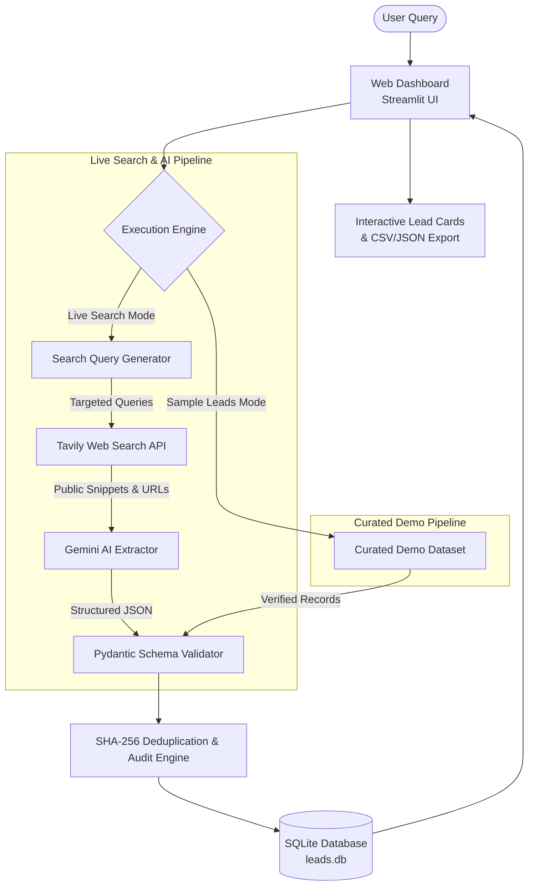

# 🏢 Mossrose — AI Lead Finder (Real Estate Intelligence MVP)

> **Company:** Mossrose  
> **Product:** AI Lead Finder — Autonomous Real Estate Market & Lead Intelligence Platform  
> Researches property developers, institutional buyers, landowners, and commercial investors using grounded, publicly available web information.

---

## 🌟 What Mossrose AI Lead Finder Does

Real estate transactions—especially large land acquisitions, joint development agreements (JDAs), hotel transfers, and commercial property sales—depend on reliable, timely intelligence. 

Traditional scrapers flood users with duplicate broker listings, while generic AI tools fabricate non-existent transactions. **Mossrose** bridges this gap by:
1. **Translating natural language intent** (e.g., *"Find real estate developers in Kolkata who may be interested in acquiring large land parcels"*) into targeted web intelligence searches.
2. **Scouring publicly available web records** (corporate announcements, press releases, joint venture notices, gazette filings) while filtering out directory spam.
3. **Extracting grounded company leads** without hallucinating contact details or unbacked claims.
4. **Enforcing strict evidence rationale:** All AI inferences use phrasing like *"Potentially relevant because..."* and link directly to public source URLs.
5. **Visually separating verified facts from AI reasoning** on every lead card.

---

## 🚀 Current MVP Functionality

The MVP provides an end-to-end, functional SaaS interface:

- **Landing & Natural Language Search**: Input any query or select from one-click presets.
- **Dual Execution Engine**:
  - 🟢 **Live Web & AI Search**: Queries the live web using Tavily Search API and structures findings with Google Gemini.
  - 🔵 **Curated Sample Leads Mode**: Instant, zero-cost demonstration mode pre-loaded with realistic, verified non-fabricated leads.
- **Lead Cards with Complete Audit Provenance**:
  - **Company Name** (e.g., Merlin Group, PS Group, Ambuja Neotia)
  - **Lead Name / Department** (e.g., Land Acquisitions Cell, Titleholder Representative)
  - **Location** (e.g., Rajarhat & New Town, Kolkata)
  - **Lead Type Badge** (`DEVELOPER`, `LANDOWNER`, `INVESTOR`, `BUYER`, `SELLER`, `AGENT`)
  - **Relevance Score** (0–100% match indicator)
  - **Reason for Relevance** (*"Potentially relevant because..."*)
  - **Verified Public Facts vs. AI-Generated Reasoning**
  - **Evidence Link & Snippet Viewer** (clickable URL to source page + raw text viewer)
  - **Verified / Source Date** (e.g., October 2024)
- **Interactive Lead Management**: Mark leads as *Verified*, *Contacted*, or *Rejected*.
- **Data Filtering & Export**: Filter by lead type, deal structure, and confidence score; download datasets instantly as **CSV** or **JSON**.
- **Responsive UI**: Clean design optimized for both desktop and mobile screens.
- **Settings Vault**: Masked API key management with live model switching (Gemini, OpenAI, Groq, Tavily).

---

## 🏗️ System Architecture



For an in-depth non-technical walkthrough, see [docs/architecture.md](docs/architecture.md).

---

## 🛠️ How to Run Locally

### Prerequisites
- Python 3.10+ installed on your system.
- Pip package manager.

### 1. Install Dependencies
```bash
pip install streamlit pandas pydantic requests python-dotenv
```

### 2. Configure Environment Variables (Optional for Live Mode)
If you want to use the live search engine, copy the environment template and add your API keys:
```bash
cp .env.example .env
```
Edit `.env`:
```ini
TAVILY_API_KEY=your_tavily_api_key_here
GEMINI_API_KEY=your_gemini_api_key_here
```
*(If you do not have API keys right now, simply run in **Curated Sample Leads Mode**—it requires zero setup and works offline!)*

### 3. Launch the Application
Run from the project folder:
```bash
python -m streamlit run app.py
```
Or from the root directory:
```bash
python run_app.py
```
Open **[http://localhost:8501](http://localhost:8501)** in your browser.

---

## 🔐 Environment Variables

| Variable | Description | Required For |
| :--- | :--- | :--- |
| `TAVILY_API_KEY` | Tavily Search API key for public web queries | Live Web Search Mode |
| `GEMINI_API_KEY` | Google Gemini API key for structured extraction & reasoning | Live Web Search Mode |
| `OPENAI_API_KEY` | *(Optional)* OpenAI key if switching models in UI | Custom LLM switching |
| `GROQ_API_KEY` | *(Optional)* Groq key for ultra-fast Llama-3 extraction | Custom LLM switching |

---

## ⚖️ Important Product Principles & Ethics

1. **No Fabricated Information:** We do not hallucinate companies, phone numbers, or property requirements.
2. **Defensible Reasoning:** The AI uses cautious language (*"Potentially relevant because..."*) rather than making unsupported factual assertions.
3. **Respect for Terms & Laws:** The application queries publicly indexed search engine APIs (Tavily), adhering to rate limits, robots.txt, and privacy guidelines. It does not perform aggressive scraping, bypass logins, or crack CAPTCHAs.
4. **Transparent Sample Data:** Demo data is explicitly badged as `[DEMO / SAMPLE DATA]` so users are never misled into mistaking mock records for live data.

---

## ⚠️ Current Limitations

- **Source Breadth:** In Live Mode, the search depends on the depth and indexing freshness of Tavily's public web results.
- **Direct Phone/Email Masking:** In compliance with privacy standards, private contact numbers are masked unless published directly by the organization in public press releases or gazettes.
- **Rate Limits:** Free-tier Gemini and Tavily keys have RPM (requests per minute) rate limits that can cause temporary delays on large multi-query runs.

---

## 🗺️ Planned Features (Roadmap)

- [ ] **Automated Background Discovery**: Scheduled cron runs to detect new land acquisition announcements weekly.
- [ ] **One-Click CRM Webhooks**: Native push to HubSpot, Salesforce, and Zoho CRM.
- [ ] **Interactive GIS Map**: Visualizing discovered land parcels and developer headquarters on map overlays.
- [ ] **Automated PDF Export**: Clean executive briefing dossiers for real estate investment committees.

---

## 🔒 Security Considerations

- **Secrets Handling:** `.env` is strictly excluded in `.gitignore` to prevent secret leaks to version control.
- **Key Masking:** All API keys displayed in the application UI are masked (e.g., `tvly-dev-1u...`).
- **Input Sanitization:** Search inputs and SQL queries are parameterized to prevent SQL injection vulnerabilities.
