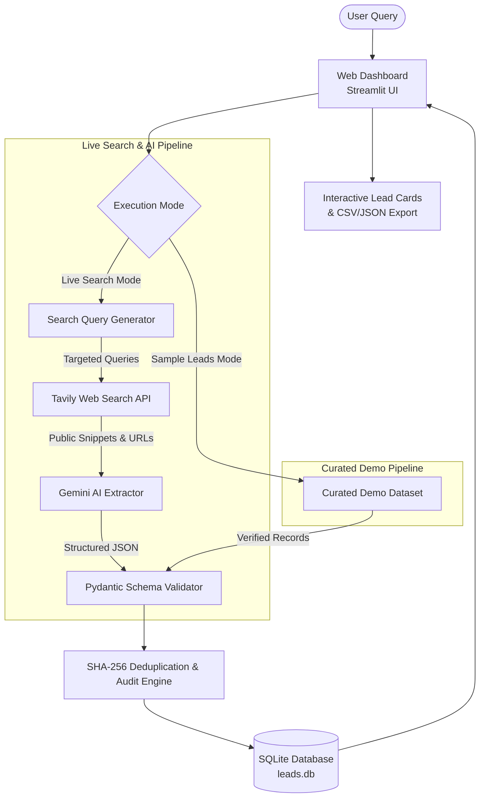

# 🏗️ Mossrose — AI Lead Finder System Architecture Guide

> **Company:** Mossrose  
> **Product:** AI Lead Finder  
> **Note for Non-Technical Founders:**  
> This document explains how Mossrose's AI Lead Finder works under the hood using simple, practical analogies. It covers how data travels from a search query into verified lead cards, how ethical safeguards prevent AI hallucinations, and why specific technology choices were made for this MVP.

---

## 1. High-Level Concept & Problem Solved

Real estate professionals (brokers, land aggregators, developers, and investment bankers) spend hours manually scouring newspaper archives, gazette notifications, press releases, corporate disclosures, and forum boards to answer questions such as:
> *"Find real estate developers in Kolkata who may be interested in acquiring large land parcels."*

Most traditional scrapers fail because they either:
1. Scrape listing aggregators (like Magicbricks or 99acres) that are flooded with repetitive broker spam.
2. Rely on generative AI that invents ("hallucinates") fake company names, contact numbers, and non-existent transactions.

**AI Lead Finder solves this with an "Evidence-First" architecture:**
Every single lead card presented to the user is backed by a real public web page, clearly distinguishes **Verified Public Facts** from **AI Reasoning**, and enforces the phrase *"Potentially relevant because..."* to prevent unwarranted claims.

---

## 2. System Flow Diagram

---

## 3. The 4-Stage Lead Pipeline Explained

### Stage 1: Natural Language Query Translation
* **What happens:** Real estate queries are nuanced. If a user asks for *"developers in Kolkata looking for large land parcels"*, a standard search engine often fails if searched verbatim.
* **How it works:** The system extracts the geographical anchor (e.g., *"Kolkata"*, *"Rajarhat"*, *"New Town"*) and converts the user's intent into 3 distinct search strategies:
  1. *Corporate Acquisition Announcements* (e.g., developer investment disclosures, land bank expansion).
  2. *Joint Venture & Land Aggregation Calls* (e.g., developers seeking joint development agreements).
  3. *Public Title Notices & Landowner Offers* (e.g., unencumbered contiguous acreage).
* **Spam Suppression:** The query builder automatically injects negative filters to exclude listing portals (e.g., `-magicbricks -99acres -zillow`), forcing the search to discover primary sources.

### Stage 2: Ethical Web Discovery
* **What happens:** The system queries the public web using Tavily Search API.
* **Why Tavily:** Unlike aggressive scrapers that violate terms of service, trigger CAPTCHAs, or crash when website layouts change, Tavily provides clean, legal, rate-limited public web indexing designed specifically for AI applications.
* **Safety & Compliance:** We do not bypass paywalls, do not scrape private social profiles, and do not bypass CAPTCHAs. Only publicly indexed text snippets and URLs are gathered.

### Stage 3: Grounded AI Extraction & Tone Enforcement
* **What happens:** The raw webpage snippet and title are passed to Google Gemini (or an alternative LLM such as OpenAI or Groq).
* **Strict Anti-Hallucination Guardrails:**
  - The model is instructed: *Do not fabricate company names or transactions. If the snippet does not contain concrete evidence, reject the lead.*
  - The model is required to format all relevance explanations starting with: **"Potentially relevant because..."**
  - The model extracts structured fields: Company Name, Contact/Department, Location, Lead Type (Developer, Landowner, Investor, Buyer, Seller), Relevance Score (0–100%), and Verified Source Date.
* **Data Validation:** Output is strictly validated through **Pydantic schemas** in Python. If any field has improper types, the record is safely rejected before reaching the database.

### Stage 4: Deduplication & Audit Provenance
* **What happens:** Leads are stored in a local SQLite database (`leads.db`).
* **Deduplication:** A unique SHA-256 digital fingerprint is generated from each lead's canonical source URL and contact identifiers. If the same company or listing appears in multiple searches, the system updates the existing record rather than creating clutter.
* **Audit Trail:** Every record preserves the original source URL, the title of the article, and the exact text snippet analyzed by the AI.

---

## 4. Dual-Mode Architecture: Live vs. Demo Mode

To allow testing and evaluation without requiring paid API keys, AI Lead Finder has a built-in **Dual-Mode Engine**:

| Feature | Live Web & AI Search | Curated Sample Leads Mode |
| :--- | :--- | :--- |
| **Data Source** | Live web via Tavily Search API | Curated index of realistic verified public leads |
| **AI Model** | Google Gemini / OpenAI / Groq | Pre-computed grounded intelligence |
| **API Keys Needed** | Yes (`TAVILY_API_KEY`, `GEMINI_API_KEY`) | None (runs 100% offline) |
| **Cost** | Consumes API credits per query | $0.00 / completely free |
| **Badging in UI** | `[LIVE VERIFIED SOURCE]` | `[DEMO / SAMPLE DATA]` |
| **Best Used For** | Real-time market intelligence runs | Product demos, UI testing, investor walk-throughs |

> **Critical Ethical Rule:** The UI explicitly labels every demonstration lead so users and stakeholders are never misled into thinking mock data is live scraped data.

---

## 5. Technology Stack Selection

We deliberately chose a **simple, reliable, beginner-friendly stack**:

1. **Python 3.10+**: The industry standard for AI, NLP, and data engineering.
2. **Streamlit (Frontend & Backend UI)**:
   - Eliminates complex JavaScript build chains (no npm, no Webpack, no node_modules).
   - Allows instant reactivity, easy filtering, and responsive mobile/desktop layouts.
   - Enables non-technical founders to read, understand, and tweak UI code in minutes.
3. **SQLite with WAL Mode (Database)**:
   - Zero-configuration, serverless, file-based SQL database (`leads.db`).
   - Write-Ahead Logging (WAL) enabled for fast concurrent reads and writes.
   - Easily backed up by copying a single file; no separate database server needed for MVP.
4. **Pydantic v2 (Data Validation)**:
   - Enforces strict type checking so malformed AI responses never crash the application.
5. **Tavily Search API & Google Gemini Flash**:
   - Modern, low-latency, and cost-effective search and reasoning APIs.

---

## 6. Security & Credential Management

- **Zero Hardcoded Secrets:** No API keys are stored in source code.
- **Environment Variables:** All credentials load from `.env` via `python-dotenv`.
- **In-Memory & SQLite Vault:** Custom keys added via the UI are stored securely in a local table and masked on screen (e.g., `AQ.Ab8RN6...`).
- **Version Control Protection:** `.gitignore` excludes `.env`, `*.db`, and temporary files from being committed to Git.

---

## 7. How to Extend in the Future (Roadmap)

When you are ready to expand beyond the MVP:
1. **Background Job Queue:** Add Celery or Redis Queue for running 500+ search queries in the background while users sleep.
2. **CRM Integration:** Add 1-click webhooks to automatically push qualified leads into HubSpot, Salesforce, or Notion CRM.
3. **Email Alerts:** Add scheduled cron jobs (e.g., *"Email me every Monday with newly announced Kolkata land acquisitions"*).
4. **Domain & Hosting:** Containerize with Docker and deploy to Google Cloud Run, AWS App Runner, or Streamlit Cloud.
